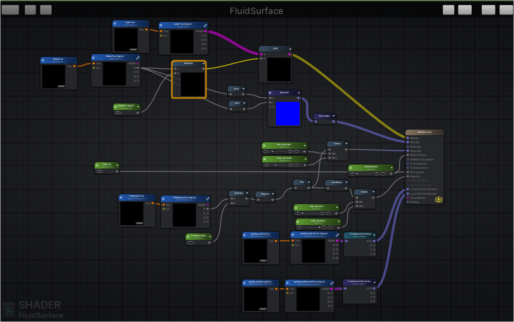

Surface Shading
=============================

In previous asset, Surface Shading has lots of limitations:

* achieved by ImageEffects on Camera, which is no longer supported in `URP`.
* do not work well when there are transparent objects in scene.
* do not support mulitiple lights and global illumination.

In a word, it limits as it's just some sort of imageEffects.

In our implementation, we **reconstruct the fluid surface from textures** using quads of different resolutions (or dimensions).

Based on that, `Amplify Shader Editor` was used to write a surface shader ``Fluid Surface.shader``  for that surface. **Therefore the rendering process of fluid surface can be integrated into Unity's Rendering Pipeline.**

Textures Description
---------------------
To understand how to change surface shading, textures generated from ``SSF_TextureGenerator`` should be understood.

+---------------------------+----------------+-----------------------------------------------------------------------------+
|       Textures Name       | Texture Format |                                 Description                                 |
+---------------------------+----------------+-----------------------------------------------------------------------------+
|      ``DepthTexture``     |        R       |                    origin depth of particles in ViewSpace                   |
+---------------------------+----------------+-----------------------------------------------------------------------------+
|    ``ThicknessTexture``   |        R       |               describes how thick the fluid is from ViewSpace               |
+---------------------------+----------------+-----------------------------------------------------------------------------+
|      ``NoiseTexture``     |        R       |         used to peturb surface normal and add Foam effect, ViewSpace        |
+---------------------------+----------------+-----------------------------------------------------------------------------+
|  ``SmoothedDepthTexture`` |        R       |                   smoothed depth of particles in ViewSpace                  |
+---------------------------+----------------+-----------------------------------------------------------------------------+
| ``EyeSpaceNormalTexture`` |      RGBA      |  fluid surface normal generated from ``SmoothedDepthTexture`` in ViewSpace  |
+---------------------------+----------------+-----------------------------------------------------------------------------+
|   ``EyeSpacePosTexture``  |      RGBA      | fluid surface position generated from ``SmoothedDepthTexture`` in ViewSpace |
+---------------------------+----------------+-----------------------------------------------------------------------------+

Surface Shader
--------------------------
It's already described that surface is created from a quad mesh.

On enabling the ``SSF_TextureGenerator``, two things happen simultaneously.

* a script called ``SSF_RenderSurface`` will be attached.
* a GameObject which is the Surface Mesh will be attached as **the child** of `ParticleSource` of ``SSF_TextureGenerator``

.. note:: Tuning the parameters of ``SSF_RenderSurface`` and ``SSF_TextureGenerator`` to ajust surface appearance .

Through opening the ``Fluid Surface.shader``, the graph flow can be viewed.

We mainly do following things:

#. render mesh as transparent object
#. replace the quad's vertices' positions and normals with fluid surface normal and vertices.
#. sample from ``ThickenessTexture`` to set opacity
#. take fluid's `Index of Refraction` into Consideration and set ``Refraction`` / ``Reflection`` port
#. sample from ``NoiseTexture`` to peturb normal and add Foam Effect
#. sample from ``ColorTexture`` to set ``Albedo`` port

.. note:: It's recommended to open the ``Fluid Surface.shader`` using `Amplify Shader Editor`.

For customization purposes, you can copy this shader and make your customization. 

Then assign the shader as the `Shader` Input to ``SSF_RenderSurface``.