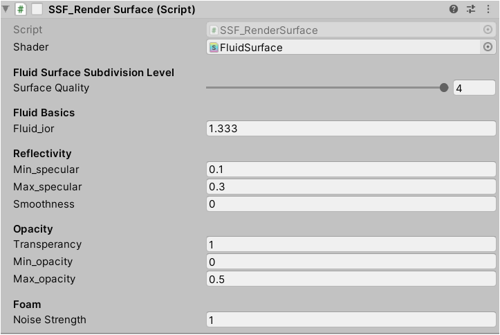

SSF_RenderSurface
===================
This script is used to ajust the surface shading appearance and quality.

The logic is straight forward.

When enabled:

1. it creates a plane mesh (according to `surfaceQuality`)
2. set the mesh as the child of the ParticleSource, which ensures visablity.
3. attach ``FluidSurface`` Shader to that mesh and ajust params as setted.

Param Tuning
---------------

shader
    shader used to reconstruct surface and rendering.
fluid_ior
    controls the Index of Refration of fluid, water is 1.333 
surfaceQuality
    Fluid Surface Subdivision Level,corresponding to ``fluid_surface_meshes``
    in ``SSF_TextureGenerator``.
min/max_specular:
    control specular of fluid surface, as the specular is generated based on `Lambert-Beer Law`

smoothness
    controls Reflectivity,0 is roughest,1 is smoothest
transperancy 
    controls opacity based on `thickness`, 0 is transparent, 1 is fully non-transparent
min/max_opacity:
    controls the bounds of opacity, 0 is transparent, 1 is fully non-transparent
noiseStrength
    controls the significance of Foam Effect and Normal Peturbition.

